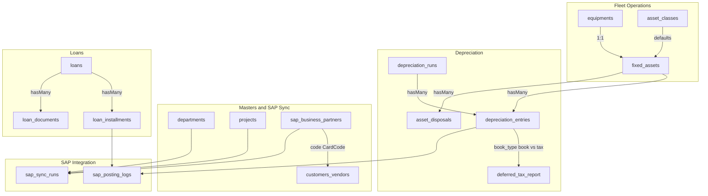
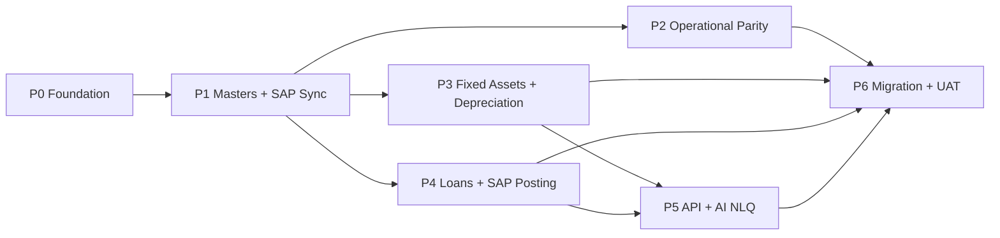

**Purpose**: Greenfield rebuild plan for ARKFleet v2 (fleet operations + SAP B1 accounting support)  
**Last Updated**: 2026-07-16  
**Changelog**: Merged [PRD-AccountingOne-Support.md](./PRD-AccountingOne-Support.md) — SAP B1 master sync, business partners, loan administration, SAP posting, phased action plan.

# ARKFleet v2 Rebuild

A greenfield rebuild of the current Laravel 10 / AdminLTE app ([architecture.md](./architecture.md)) onto a modern SPA-style stack, with full feature parity plus SAP B1 accounting support (master-data sync, controlled financial posting), a dual-book Fixed-Asset Depreciation module, loan administration, and AI natural-language reporting.

## Overview

Rebuild ARKFleet as a fresh Laravel 12 + Inertia/React + Ant Design app with full feature parity (Equipment, Projects, Movings/IPA, Documents, Reports, API, RBAC) plus:

- **SAP B1 integration** — keep operational masters aligned with SAP; post loan installments and depreciation journals via Service Layer.
- **Dual-book Asset Depreciation** sub-ledger (PSAK commercial + UU PPh fiscal) with deferred-tax reporting.
- **Loan administration** — hybrid PDF upload → parse → review → Service-type AP Invoice + Outgoing Payment posting.
- **OpenRouter-powered** natural-language reporting assistant (guarded, read-only).

Derived from [PRD-AccountingOne-Support.md](./PRD-AccountingOne-Support.md). SAP reference docs: [SAP-B1-SESSION-MANAGEMENT.md](./SAP-B1-SESSION-MANAGEMENT.md), [SAP-B1-PROJECTS-DEPARTMENTS-INTEGRATION-PLAN.md](./SAP-B1-PROJECTS-DEPARTMENTS-INTEGRATION-PLAN.md), [SAP_B1_BUSINESS_PARTNERS_SYNC_RECOMMENDATION.md](./SAP_B1_BUSINESS_PARTNERS_SYNC_RECOMMENDATION.md).

## Target Stack

- **Backend**: Laravel 12 (PHP 8.3+), MySQL 8, Sanctum (API tokens), Spatie Laravel Permission (RBAC)
- **Auth**: Laravel session auth (Inertia) for the main app — login, logout, change password from navbar; Sanctum for `/api/v1/*`
- **Frontend**: Inertia 2 + React 18 + TypeScript + Vite, **Ant Design 5** + `@ant-design/pro-components` (ProLayout/ProTable/ProForm for enterprise CRUD) — replaces AdminLTE/jQuery/Yajra DataTables; dark theme default, light optional
- **SAP B1**: Service Layer via Guzzle **CookieJar** (`B1SESSION`/`ROUTEID`); singleton `SapService` with `ensureSession()` + 401-retry-once; Laravel Queue + Scheduler for syncs/postings
- **Exports/AI**: `maatwebsite/excel`, `barryvdh/laravel-dompdf`, OpenRouter via Laravel HTTP client
- **Location**: scaffold in `D:\project\arkfleet-next` (new git repo) so the current app keeps running as reference. Data stays fresh now; a migration script comes later.

## Decisions Captured

- **Modules**: Auth/RBAC, Projects, Equipment, Master Data, Movings/IPA, Documents, Reports, REST API, SAP master sync, Business Partners, Loans, SAP posting — all in scope.
- **Data**: build fresh + seeders/sample data now; write a one-time migration script from the legacy DB later.
- **SAP masters**: Projects & Departments sync by `sap_code`; preserve `is_selectable` and local-only fields on every update.
- **Business partners**: dual storage — `sap_business_partners` mirror linked to local customer/vendor tables by `code` ↔ `CardCode`.
- **SAP writes**: all posts (AP Invoice, Outgoing Payment, Journal Entry) go through a shared `PostingService` with idempotency keys; no silent double-posts.
- **Depreciation**: **dual-book** — commercial (PSAK) and fiscal/tax (UU PPh Kelompok 1-4 + bangunan), calculated in-app; SAP receives journals (not full FA submodule sync unless finance confirms otherwise).
- **Loans**: header + installments; hybrid PDF → draft schedule → accountant review/confirm before SAP post; Service-type AP Invoice with principal + interest GL lines.
- **AI**: OpenRouter for natural-language reporting/queries (guarded, read-only).
- **UX**: dark theme default; permission-gated sidebar and SAP actions.

## Key Gap to Close

The legacy `equipments` table ([create_equipments_table](../database/migrations/2022_11_14_003719_create_equipments_table.php)) has **no financial fields** (no acquisition cost, in-service date, salvage value, or useful life). Depreciation requires a dedicated fixed-asset profile layered on equipment.

## Data Model

### Fixed assets & depreciation

- `asset_classes`: per-class defaults for BOTH books — `book_method`, `book_useful_life_months`, `book_residual_rate`; `tax_group` (Kelompok 1-4/Bangunan), `tax_method`, `tax_useful_life`, `tax_rate`.
- `fixed_assets` (1:1 `equipments`): `acquisition_cost`, `acquisition_date`, `in_service_date`, `salvage_value`, per-book method/life/start overrides, `status` (active/disposed/fully_depreciated).
- `depreciation_runs`: a posting batch for a period (year+month), status, totals, run_by.
- `depreciation_entries`: `fixed_asset_id`, `book_type` (book|tax), `period_date`, `opening_nbv`, `depreciation_amount`, `accumulated_depreciation`, `closing_nbv`, `run_id`. Idempotent per asset+book+period.
- `asset_disposals`: disposal date, proceeds, type (sale/scrap/writeoff), book & tax NBV at disposal, gain/loss per book.

### SAP-aligned masters

- `departments`, `projects`: add `sap_code`, `is_selectable`, `synced_at`, optional `parent_id`; sync upserts by `sap_code`, preserves `is_selectable` and local acronym/parent fields. See [SAP-B1-PROJECTS-DEPARTMENTS-INTEGRATION-PLAN.md](./SAP-B1-PROJECTS-DEPARTMENTS-INTEGRATION-PLAN.md).
- `sap_business_partners`: full SAP mirror + `metadata` JSON; linked to local customer/vendor tables by `code` ↔ `CardCode`. See [SAP_B1_BUSINESS_PARTNERS_SYNC_RECOMMENDATION.md](./SAP_B1_BUSINESS_PARTNERS_SYNC_RECOMMENDATION.md).

### Loans

- `loans`: vendor `CardCode`, contract no, principal, term, rate, currency, default principal-GL / interest-GL / tax-code / cost-center-department, status.
- `loan_installments`: installment_no (`n of total`), due/posting/document dates, `principal_amount`, `interest_amount`, total; per-installment editable GL accounts + tax code + cost-center/department; Faktur Pajak no/date; vendor ref no; SAP AP-Invoice DocEntry/DocNum; Outgoing Payment link; status (`draft` → `confirmed` → `posted` → `paid`).
- `loan_documents`: uploaded installment PDF as source document; parsed-vs-confirmed flag.

### SAP observability

- `sap_sync_runs`: entity type, started/finished, counts (created/updated/failed), error summary.
- `sap_posting_logs`: idempotency key, document type, DocEntry/DocNum, status, error payload, user, timestamps.

## SAP B1 Integration Layer

- `App\Services\Sap\SapService` — **singleton** with Guzzle CookieJar; `ensureSession()`; on 401 re-login and retry once. See [SAP-B1-SESSION-MANAGEMENT.md](./SAP-B1-SESSION-MANAGEMENT.md).
- Per-entity **sync services** — upsert by `sap_code`; preserve local-only fields (`is_selectable`, `parent_id`, acronyms); store full SAP payload in `metadata` JSON; manual permission-gated Sync button + daily scheduler with `withoutOverlapping()`.
- `App\Services\Sap\PostingService` — validate local state → post to Service Layer → persist DocEntry/DocNum → mark local status; on failure store error and leave retryable state. Idempotency keys block double-post (e.g. `loan_installment_id` + document type).
- Heavy sync/post runs on **queues** with retries; dedicated SAP technical user per environment (DEV/UAT/PROD).

## Loan Administration

- **Hybrid PDF flow**: accountant uploads loan-installment PDF → app auto-parses (OCR/text-layer) a **draft** schedule (installment no, principal, interest, dates) → accountant **reviews/confirms** before any SAP posting. PDF retained as source document. Sample PDF is image-based; parser robustness is a build risk.
- **AP Invoice mapping** (from sample SAP screenshot): each installment posts as a **Service-type A/P Invoice** with **two service lines**:
  - **Principal** — e.g. G/L `22201017`, description "Nth installment ... ( Principal )"
  - **Interest** — e.g. G/L `71201004` (Biaya Bunga Pinjaman), description "Installment ... ( Interest )"
  - Each line carries Tax Code (e.g. `B100`). Header: Vendor `CardCode`, series `No.`, Posting/Document/Due dates, Cost Center/Department dimension, Faktur Pajak No./Date, Contract No., Installment No. (`n of total`), Vendor Ref. No., currency (IDR), Remarks. Total Payment Due = principal + interest.
- **Per-installment overrides**: GL accounts, tax code, and cost-center/department default from loan header but are **editable per installment** before posting.
- Lock schedule after first successful AP post; installment payment → SAP **Outgoing Payment**.

## Business Partners

- Dual storage: `sap_business_partners` mirror + local customer/vendor tables.
- Chunked upsert sync (CardType C/S/L, active-only); `tYES`/`tNO` and decimal handling.
- AntD Select/AutoComplete backed by synced data; `CardCode` validation before SAP submissions.
- Admin: filters (type, active), sync trigger, metadata inspection.

## Depreciation Engine

- `App\Services\Depreciation\DepreciationCalculator` with a strategy per method: **StraightLine, DecliningBalance (double-declining), SumOfYearsDigits, UnitsOfProduction**.
- Convention default: depreciation begins in the in-service month; monthly = annual / 12 (configurable). Each asset is computed independently for the `book` and `tax` books.
- `php artisan depreciation:run {year} {month} {--book=all}` + a UI "Run Depreciation" action; re-runnable/idempotent per period.
- Deferred-tax report = (tax accumulated depreciation - book accumulated depreciation) × tax rate, as a temporary-difference schedule.
- **SAP journal posting**: period batch preview → confirm → queue Journal Entry posts via `PostingService`; no second journal per asset+period without explicit reversal. Consolidated vs per-asset journal is a finance decision (open question).

## AI Natural-Language Reporting (OpenRouter)

- `App\Services\AI\OpenRouterClient` (HTTP), key + model in `config/services.php` / `.env`.
- Flow: user question + a curated read-only schema/metric catalog → LLM returns a **constrained, validated query spec** (allowlisted tables/columns, read-only connection) → results rendered in an AntD table/chart. No free-form write SQL.

## RBAC (Spatie Laravel Permission)

Permissions (seeded):

| Permission | Scope |
|------------|-------|
| `view` | Read access to modules |
| `sync` | Trigger SAP master-data sync |
| `manage-visibility` | Toggle `is_selectable` on projects/departments |
| `sap.post` | Submit AP Invoices, Outgoing Payments, depreciation journals to SAP |

Roles:

| Role | Permissions |
|------|-------------|
| Admin | All |
| Accountant | view + sync + sap.post |
| Manager | view |
| admin / manager / user | Legacy operational roles (mapped alongside finance roles) |

Share `auth.permissions` to React; gate sidebar modules and SAP action buttons via `@can` / Inertia shared props.

## Feature Parity Mapping (Legacy → v2)

| Legacy | v2 |
|--------|-----|
| Equipment + master data | Inertia pages with ProTable (server-side pagination replaces Yajra) |
| Projects | SAP-synced master + CRUD; `selectable()` + `active()` dropdown scopes |
| Departments | SAP-synced master + visibility toggle |
| Movings/IPA cart | Per-user `cart_items` table (fixes legacy global `cart_flag` concurrency — [todo.md](./todo.md)) |
| Documents + expiry alerts | Dashboard widgets + report |
| Reports + Excel/PDF | `maatwebsite/excel` + `dompdf` |
| REST API | Port `/api/v1/*` (Sanctum) from legacy API controllers; add fixed-asset/depreciation endpoints |
| — (new) | Business Partners mirror + sync + form selectors |
| — (new) | Loan administration + PDF parse + SAP AP Invoice / Outgoing Payment |
| — (new) | SAP journal posting for depreciation |
| — (new) | AI natural-language reporting |

## Risks / Notes

- Dual-book doubles schedule rows and calculation paths — engine must treat book/tax as parallel computations from day one.
- Indonesian tax rules (PMK group rates, full-month convention) should be confirmed against current regulations before go-live.
- AI query layer must run on a read-only DB connection with strict allowlisting to prevent data exfiltration/mutation.
- SAP session-limit exhaustion — mitigate with singleton `SapService` and bounded queue workers.
- Double-post of payments/journals — idempotency keys + status machine; refuse re-post if success already recorded.
- Unclear SAP document mapping (series, tax groups, dimensions) — run SAP field workshop (R30) before P3/P4 build.
- Feature-flag / permission-gate SAP posting in production until UAT sign-off; staging uses non-production SAP company DB.
- Loan PDF parser — image-based PDFs need OCR; treat parse output as draft only until accountant confirms.

## Phased Implementation Action Plan

Ordering respects dependencies: SAP foundation before any sync/post; Business Partners before Loans; Equipment financial fields before Depreciation.

### Phase 0 — Foundation & platform

| ID | Task | Status |
|----|------|--------|
| scaffold | Laravel 12 + Inertia 2 + React 18 + Vite; AntD 5 + Pro Components; Sanctum, Spatie Permission, maatwebsite/excel, dompdf; Pint/ESLint/Prettier | done |
| auth-rbac | Session auth (login/logout/change password) + Spatie permissions (`view`, `sync`, `manage-visibility`, `sap.post`) and roles (Admin/Accountant/Manager + legacy admin/manager/user) | done |
| shell | ProLayout sidebar + header + user dropdown; dark (default)/light theme; permission-gated menu; shared ProTable/ProForm wrappers | done |
| sap-foundation | `SapService` singleton, CookieJar session, config/env, `sap_sync_runs`/`sap_posting_logs`, queue worker + scheduler | done |

**Exit criteria**: user can log in, switch theme, see permission-gated modules; `SapService` smoke-test login to Service Layer.

### Phase 1 — Master data & SAP sync

| ID | Task | Status |
|----|------|--------|
| core-data | CRUD for master data (unit_models, manufactures, plant_types, plant_groups, asset_categories, unitstatuses, suppliers, departments), Projects; Equipment register extended with financial fields | done |
| master-sync | Projects & Departments sync by `sap_code`; preserve `is_selectable`; manual Sync + daily scheduler; visibility toggle UI | done |
| business-partners | `sap_business_partners` mirror + chunked sync + AntD selectors + `CardCode` validation | done |

**Exit criteria**: masters CRUD works; Projects/Departments/BP sync populates rows, logs to `sap_sync_runs`, preserves `is_selectable`.

### Phase 2 — Operational feature parity

| ID | Task | Status |
|----|------|--------|
| movings | Movings/IPA with per-user `cart_items` + PDF transfer document | done |
| documents | Documents module (types, expiry, renewals, attachments) + dashboard expiry alerts | done |
| reports-export | Operational reports (expiring docs, IPA summary, active status) + Excel/PDF export | done |

**Exit criteria**: transfers/documents/reports match legacy behavior with server-side pagination.

### Phase 3 — Fixed assets & dual-book depreciation

| ID | Task | Status |
|----|------|--------|
| fixed-assets | `asset_classes` + `fixed_assets` (1:1 equipment) tables/models + CRUD UI | done |
| dep-engine | DepreciationCalculator strategies for book + tax; `depreciation_runs` + `depreciation_entries`; artisan command + UI run action (idempotent) | done |
| disposal-deferred | Asset disposal/write-off; depreciation schedule view; deferred-tax report | done |
| sap-dep-posting | Depreciation journal posting to SAP via `PostingService` (preview → confirm → queue) | done (feature-gated) |

**Exit criteria**: dual-book schedules compute; deferred-tax reconciles; confirmed period posts journals to staging SAP.

### Phase 4 — Loan administration & AP posting

| ID | Task | Status |
|----|------|--------|
| loans | `loans`/`loan_installments`/`loan_documents` schema + CRUD | done |
| loan-pdf-parse | PDF upload → auto-parse draft schedule → accountant review/confirm | done |
| loan-sap-posting | Service-type AP Invoice (principal + interest GL lines, editable per installment) + Outgoing Payment via `PostingService`; idempotency + schedule lock | done (feature-gated) |

**Exit criteria**: draft from sample PDF → confirm → post one AP Invoice to staging SAP with DocEntry/DocNum stored; re-post refused.

### Phase 5 — REST API & AI reporting

| ID | Task | Status |
|----|------|--------|
| api | Sanctum `/api/v1/*` (equipment, projects) + fixed-asset/depreciation endpoints; rate limiting + API-key UI | done |
| ai-nlq | OpenRouterClient + guarded NLQ (schema catalog → validated read-only query → AntD table/chart) | done |

**Exit criteria**: API authenticated + documented; NLQ answers sample question on read-only connection.

### Phase 6 — Data migration, docs & UAT

| ID | Task | Status |
|----|------|--------|
| seeders-migration | Seeders/sample data; draft (not run) legacy→v2 migration script | done |
| docs | Update `architecture.md`, `decisions.md`, `MEMORY.md`, `todo.md` | done |
| uat-rollout | UAT checklist; feature-gate SAP posting until sign-off; idempotency tests | done |

**Exit criteria**: fresh install seeds and runs; UAT passes; SAP posting enabled only after sign-off.

## Open Questions (close before P3/P4 build)

1. Is SAP **Fixed Assets** already the master for company assets, or is ARKFleet the calculation master with journals only?
2. Exact SAP document **series**, tax groups (is `B100` zero/exempt?), and dimension rules for AP Invoice, Outgoing Payment, and Journal Entry.
3. Loan counterpart always **vendor (`CardType = S`)**, or can customers/employees appear?
4. One consolidated depreciation journal per period vs one per asset?
5. Whether principal posts to a vendor-linked payable G/L (`22201017`) vs a loan-liability account.
6. Separate SAP users per environment — confirmed?
7. Incremental sync needed in year 1, or full daily sync sufficient?
