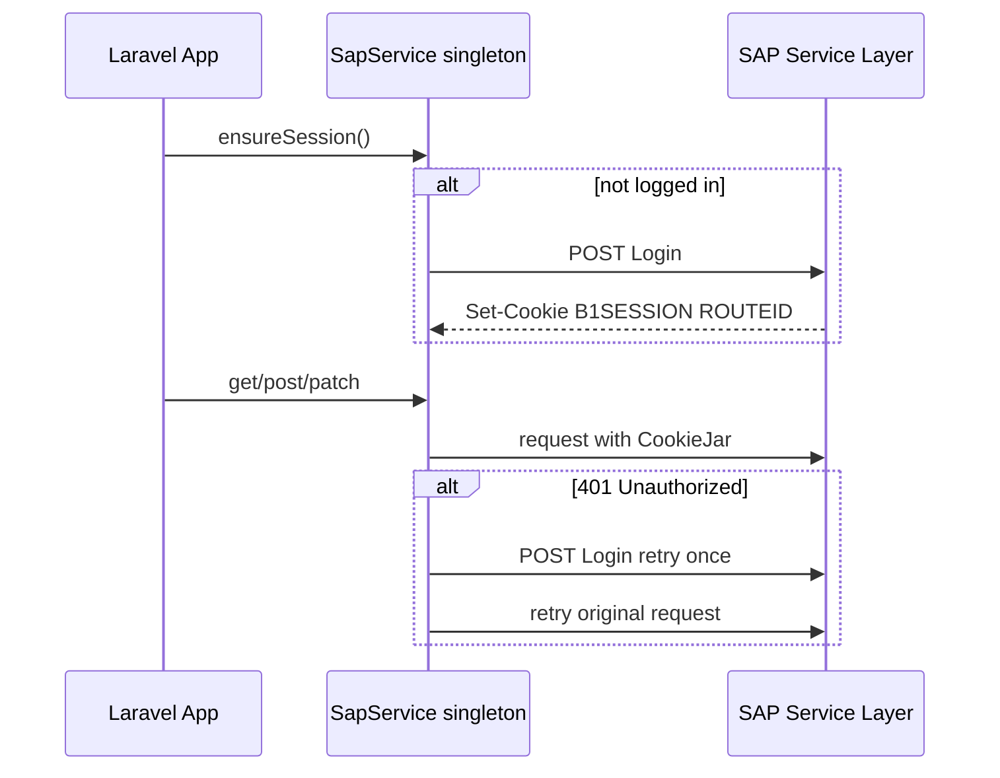

Purpose: Technical reference for understanding system design and development patterns
Last Updated: 2026-07-19

# System Architecture

## Project Overview

ARKFleet v2 is a greenfield rebuild of the legacy fleet-management app, extended with SAP B1 accounting support (master sync, loan AP posting, depreciation journals). See [ARKFleet-Rebuild-Plan.md](./ARKFleet-Rebuild-Plan.md) for the full phased roadmap.

## Technology Stack

- **Backend**: Laravel 12 (PHP 8.2+), MySQL/SQLite, Inertia Laravel adapter
- **Frontend**: Inertia 2 + React 18 + Vite, Ant Design 5 + `@ant-design/pro-components`
- **Auth**: Laravel session auth (Inertia); Laravel Sanctum installed for future `/api/v1/*`
- **RBAC**: Spatie Laravel Permission — permissions `view`, `sync`, `manage-visibility`, `sap.post`
- **SAP B1**: Guzzle HTTP + CookieJar via singleton `App\Services\Sap\SapService`
- **Exports**: `maatwebsite/excel`, `barryvdh/laravel-dompdf` — used for IPA transfer PDF and report exports
- **Queue/Scheduler**: database queue driver; `sap:ping` scheduled daily when SAP is configured

## Core Components

| Component | Path | Status |
|-----------|------|--------|
| Session auth | `app/Http/Controllers/Auth/*` | Working (login, logout, change password) |
| Inertia shared props | `app/Http/Middleware/HandleInertiaRequests.php` | Shares `auth.user` with roles + permissions |
| App shell | `resources/js/Layouts/AuthenticatedLayout.jsx` | ProLayout, dark-default theme, permission-gated menu |
| SAP session client | `app/Services/Sap/SapService.php` | Singleton; `ensureSession()`, 401-retry-once |
| SAP posting helper | `app/Services/Sap/PostingService.php` | Idempotency logging scaffold |
| Dashboard | `app/Http/Controllers/DashboardController.php` | Stats + expiring document alerts |
| IPA transfers | `app/Services/Operations/IpaTransferService.php` | DRAFT→SUBMITTED→APPROVED lifecycle, cart per IPA, equipment update, legacy-layout PDF |
| Operations UI | `resources/js/Pages/Operations/*` | IPA list/filters, create/edit header, add-equipment cart, Documents CRUD |
| Reports | `app/Http/Controllers/Reports/ReportController.php` | Expiring docs, IPA summary, active equipment + Excel/PDF |
| Depreciation engine | `app/Services/Depreciation/*` | Dual-book SL/DB/SYD/UoP; `depreciation:run` command |
| Fixed assets UI | `resources/js/Pages/Finance/*` | Capitalize, schedule, dispose, run depreciation |
| SAP dep posting | `DepreciationPostingService` | Journal preview + PostingService; gated by env flag |
| Loan admin | `app/Services/Loans/*` | PDF parse, installment confirm, AP Invoice + Outgoing Payment |
| REST API | `routes/api.php` + `Api/V1/*` | Sanctum tokens, equipment/projects/fixed-assets/depreciation |
| AI NLQ | `OpenRouterClient` + `NlqQueryService` | Guarded read-only queries at `/reports/ai-nlq` |
| API keys UI | `Settings/ApiKeys/Index` | Create/revoke Sanctum tokens |
| SAP posting gate | `App\Support\SapPostingGate` | UAT sign-off + per-module env flags |
| Legacy migration | `LegacyMigrationService` + `legacy:migrate` | Dry-run default; `legacy` DB connection |
| Demo seed data | `DemoDataSeeder` | Second equipment, expiring STNK for UAT |

## Database Schema (implemented)

- `users` — includes `username`
- Spatie permission tables (`roles`, `permissions`, pivots)
- `personal_access_tokens` — Sanctum
- `sap_sync_runs`, `sap_posting_logs` — SAP observability
- `projects`, `departments` — SAP-synced masters (`sap_code`, `is_selectable`, `synced_at`)
- `sap_business_partners` — SAP mirror with `metadata` JSON
- Fleet lookups: `unit_models`, `manufactures`, `plant_types`, `plant_groups`, `asset_categories`, `unitstatuses`, `suppliers`
- `equipment` — fleet register with financial fields
- `document_types`, `equipment_documents` — compliance docs with expiry/extend
- `cart_items` — per-IPA transfer cart (`ipa_transfer_id`, unique ipa_transfer+equipment)
- `ipa_transfers` — IPA documents (`ipa_no`, `ipa_date`, tujuan/CC rows, `status`, approval fields) + `ipa_transfer_lines`
- `projects` — includes optional `bowheer`, `location` for IPA print Dari/Tujuan block
- `asset_classes`, `fixed_assets` (1:1 equipment), `depreciation_runs`, `depreciation_entries`, `asset_disposals`
- `loans`, `loan_installments`, `loan_documents` — loan lifecycle + PDF source docs

## Routes (web)

| Method | Path | Purpose |
|--------|------|---------|
| GET | `/login` | Login form |
| POST | `/login` | Authenticate |
| GET | `/` | Dashboard |
| GET/PUT | `/change-password` | Change password |
| POST | `/logout` | Sign out |
| GET | `/masters/projects` | Projects + SAP sync |
| GET | `/masters/departments` | Departments + SAP sync |
| GET | `/masters/business-partners` | Business partners + SAP sync |
| GET/POST/PUT | `/equipment` | Equipment register |
| POST | `/equipment/update-rfu`, `/equipment/update-bd` | Bulk RFU / B/D status update (Active units only; toggles `is_rfu`) |
| GET | `/sap/sync` | Sync run history |
| GET | `/sap/posting-logs` | Posting log history |
| GET | `/movings`, `/movings/create` | IPA list (filters) + create form |
| POST/PUT/DELETE | `/movings`, `/movings/{id}` | Store/update/destroy DRAFT IPA header |
| GET | `/movings/{id}/equipment` | Add-equipment page (cart scoped to IPA) |
| POST/DELETE | `/movings/{id}/cart`, `/movings/{id}/cart/{cartItem}` | Cart add/remove |
| POST | `/movings/{id}/submit`, `/movings/{id}/approve` | Submit IPA / approve |
| GET | `/movings/{id}/show`, `/movings/{id}/pdf` | IPA detail + legacy-layout PDF |
| GET/POST/PUT/DELETE | `/documents` | Equipment documents CRUD + extend |
| GET | `/reports`, `/reports/*` | Operational reports + Excel/PDF export |
| GET/POST/PUT | `/fixed-assets` | Fixed asset register + capitalize |
| GET | `/fixed-assets/{id}/schedule` | Per-asset depreciation schedule |
| POST | `/fixed-assets/{id}/dispose` | Asset disposal/write-off |
| GET/POST | `/depreciation`, `/depreciation/run` | Depreciation runs + period execution |
| GET | `/depreciation/deferred-tax` | Deferred tax temporary-difference report |
| POST | `/depreciation/runs/{id}/confirm`, `/post-sap` | SAP journal confirm/post (`sap.post`) |
| GET/POST | `/loans` | Loan register + create |
| GET/PUT | `/loans/{id}` | Loan detail + header update |
| POST | `/loans/{id}/documents` | Upload installment PDF (auto-parse) |
| POST | `/loans/{id}/confirm-schedule` | Confirm parsed/manual installment rows |
| PUT/POST | `/loans/{id}/installments/*` | Edit, confirm, post AP, post payment |
| GET | `/settings/api-keys` | Create/revoke Sanctum API tokens |
| GET/POST | `/reports/ai-nlq` | Natural-language read-only query UI |

## API routes (`/api/v1`)

| Method | Path | Purpose |
|--------|------|---------|
| GET | `/equipment`, `/equipment/{id}` | Equipment register |
| GET | `/projects`, `/projects/{code}` | SAP-synced projects |
| GET | `/fixed-assets`, `/fixed-assets/{id}` | Fixed asset register + schedule |
| GET | `/depreciation/runs`, `/depreciation/runs/{id}` | Depreciation run batches |
| GET | `/depreciation/entries` | Depreciation line items (filterable) |

Auth: `Authorization: Bearer {sanctum_token}` with `api:read` ability. Rate limit: 60/min.

## Data Flow — SAP session



## Security Implementation

- Session-based web auth with CSRF on forms
- Spatie permissions shared to React; sidebar items filtered by `can(permission)`
- SAP credentials in `.env` only (`SAP_BASE_URL`, `SAP_COMPANY_DB`, `SAP_USERNAME`, `SAP_PASSWORD`)
- SAP posting idempotency via unique `idempotency_key` on `sap_posting_logs`
- SAP financial posting requires `SAP_POSTING_UAT_SIGNED_OFF=true` plus module flags (`SAP_LOAN_POSTING_ENABLED`, `SAP_DEPRECIATION_POSTING_ENABLED`); shared to UI via `sapPosting` Inertia prop for `sap.post` users

## Fresh install

```bash
composer install
cp .env.example .env   # configure DB + SAP_* as needed
php artisan key:generate
php artisan migrate
php artisan db:seed
npm install && npm run build
```

Login: `admin@arkfleet.local` / `password`. UAT checklist: [UAT-checklist.md](./UAT-checklist.md).

## Legacy migration (draft)

- Configure `LEGACY_DB_*` in `.env` (separate `legacy` MySQL connection in `config/database.php`)
- `php artisan legacy:migrate` — dry-run reports row counts per entity
- `php artisan legacy:migrate --execute` — staging only, after backup + UAT

Mapped entities: users, projects, departments, equipment, equipment_documents (`config/legacy_migration.php`).

## Artisan Commands

| Command | Purpose |
|---------|---------|
| `sap:ping` | Smoke-test SAP Service Layer login |
| `sap:sync-projects` | Sync projects from SAP |
| `sap:sync-departments` | Sync profit centers as departments |
| `sap:sync-business-partners` | Sync business partners mirror |
| `depreciation:run` | Run dual-book depreciation for a period |
| `legacy:migrate` | Draft legacy→v2 import (dry-run default; `--execute` with confirm) |
