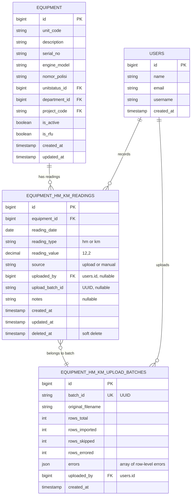

# Equipment HM/KM Tracking — Implementation Plan

**Status**: Plan (not yet implemented)
**Created**: 2026-07-19
**Context**: ARKFleet v2 (Laravel 12 + Inertia + React + Ant Design 5). Fleet/equipment management with SAP B1 integration. This feature adds Hours Meter (HM) and Kilometers (KM) reading tracking to the Equipment module, enabling maintenance scheduling based on actual usage.

> ⚠️ **This document is a plan only**. No code has been written. Use this as the implementation specification.

---

## 1. Feature Overview

### Purpose

Track periodic HM (Hours Meter) and KM (Kilometers/Odometer) readings for each equipment unit. These readings drive:

- **Maintenance scheduling** — trigger preventive maintenance when a unit reaches HM/KM thresholds.
- **Usage analytics** — reports on fleet utilisation, idle units, high-mileage units.
- **Residual value estimation** — usage-based depreciation adjustments (future phase).

### User Stories

1. As a **fleet manager**, I can upload an Excel file with HM/KM readings for multiple units so I can batch-update readings from field reports.
2. As a **fleet manager**, I can set a single date for the entire upload, OR let each row carry its own reading date.
3. As a **fleet manager**, I can view the HM/KM history of a specific unit on its detail page.
4. As a **fleet manager**, I can see which units are due for maintenance based on the latest HM/KM reading.
5. As an **admin**, only users with appropriate permissions can upload or view HM/KM data.

---

## 2. Entity-Relationship Diagram (ERD)



### Design Decisions

| Decision | Rationale |
|----------|-----------|
| Single `equipment_hm_km_readings` table (not separate HM/KM tables) | `reading_type` column discriminates; both have identical structure; simpler queries for combined reports |
| `reading_value` as `decimal(12,2)` | HM readings may have decimals (e.g. 1250.5 hours); KM readings are integers but type consistency wins |
| Soft deletes on readings | Audit trail; accidental uploads can be reverted without data loss |
| `upload_batch_id` as UUID | Links readings back to source upload; nullable for manual entries |
| `source` column (upload/manual) | Distinguishes Excel-imported from manually-entered readings for trust/heuristics |

---

## 3. Database Migration Specification

### 3.1 `equipment_hm_km_readings`

```php
// database/migrations/YYYY_MM_DD_HHMMSS_create_equipment_hm_km_readings_table.php

Schema::create('equipment_hm_km_readings', function (Blueprint $table) {
    $table->id();
    $table->foreignId('equipment_id')->constrained('equipment')->cascadeOnDelete();
    $table->date('reading_date');
    $table->string('reading_type'); // 'hm' or 'km'
    $table->decimal('reading_value', 12, 2);
    $table->string('source')->default('manual'); // 'upload' or 'manual'
    $table->foreignId('uploaded_by')->nullable()->constrained('users')->nullOnDelete();
    $table->uuid('upload_batch_id')->nullable();
    $table->text('notes')->nullable();
    $table->timestamps();
    $table->softDeletes();

    // Indexes for common queries
    $table->index(['equipment_id', 'reading_type', 'reading_date']);
    $table->index('upload_batch_id');
});
```

### 3.2 `equipment_hm_km_upload_batches`

```php
// database/migrations/YYYY_MM_DD_HHMMSS_create_equipment_hm_km_upload_batches_table.php

Schema::create('equipment_hm_km_upload_batches', function (Blueprint $table) {
    $table->id();
    $table->uuid('batch_id')->unique();
    $table->string('original_filename');
    $table->unsignedInteger('rows_total')->default(0);
    $table->unsignedInteger('rows_imported')->default(0);
    $table->unsignedInteger('rows_skipped')->default(0);
    $table->unsignedInteger('rows_errored')->default(0);
    $table->json('errors')->nullable();
    $table->foreignId('uploaded_by')->constrained('users')->cascadeOnDelete();
    $table->timestamp('created_at')->nullable();
});
```

---

## 4. Model Specifications

### 4.1 `EquipmentHmKmReading`

```php
namespace App\Models;

class EquipmentHmKmReading extends Model
{
    use SoftDeletes;

    protected $table = 'equipment_hm_km_readings';

    protected $fillable = [
        'equipment_id',
        'reading_date',
        'reading_type',
        'reading_value',
        'source',
        'uploaded_by',
        'upload_batch_id',
        'notes',
    ];

    protected function casts(): array
    {
        return [
            'reading_date' => 'date',
            'reading_value' => 'decimal:2',
        ];
    }

    // Relationships
    public function equipment(): BelongsTo { ... }
    public function uploader(): BelongsTo { ... } // -> users
    public function uploadBatch(): BelongsTo { ... } // -> EquipmentHmKmUploadBatch

    // Scopes
    public function scopeHm($query)  { return $query->where('reading_type', 'hm'); }
    public function scopeKm($query)  { return $query->where('reading_type', 'km'); }
    public function scopeForUnit($query, $unitCode) { ... }
}
```

### 4.2 `EquipmentHmKmUploadBatch`

```php
namespace App\Models;

class EquipmentHmKmUploadBatch extends Model
{
    public $timestamps = false; // only created_at
    public $incrementing = false;
    protected $keyType = 'string';
    protected $primaryKey = 'batch_id';

    protected $fillable = [
        'batch_id', 'original_filename',
        'rows_total', 'rows_imported', 'rows_skipped', 'rows_errored',
        'errors', 'uploaded_by',
    ];

    protected function casts(): array
    {
        return [
            'errors' => 'array',
        ];
    }

    public function readings(): HasMany { ... }
    public function uploader(): BelongsTo { ... }
}
```

### 4.3 Equipment model additions

Add relationship to the existing `Equipment` model:

```php
// In App\Models\Equipment
public function hmKmReadings(): HasMany
{
    return $this->hasMany(EquipmentHmKmReading::class);
}

// Convenience: latest HM and KM values as accessors
// (use with caution on large lists; prefer eager-loaded latest read in queries)
public function latestHmReading(): HasOne
{
    return $this->hasOne(EquipmentHmKmReading::class)
        ->where('reading_type', 'hm')
        ->latestOfMany('reading_date');
}

public function latestKmReading(): HasOne
{
    return $this->hasOne(EquipmentHmKmReading::class)
        ->where('reading_type', 'km')
        ->latestOfMany('reading_date');
}
```

---

## 5. Controller Design

### 5.1 `EquipmentHmKmController`

**File**: `app/Http/Controllers/Masters/EquipmentHmKmController.php`

| Method | Purpose |
|--------|---------|
| `index(Equipment)` | Returns paginated HM/KM reading history for a unit (rendered as tab on Equipment Show page) |
| `uploadForm()` | Returns the upload page with the date-modal UI |
| `upload(Request)` | Handles Excel file upload + optional date, validates, parses, creates readings + batch record |
| `store(Request, Equipment)` | Manual entry of a single reading |
| `destroy(EquipmentHmKmReading)` | Soft-delete a reading (admin only) |
| `batches()` | List upload batches with stats |
| `batchDetail(batchId)` | Show batch-level errors and row counts |

### 5.2 Upload Flow Pseudocode

```
upload(Request $request):
  1. Validate: file (xlsx/xls, max 5MB), date (optional, date format)
  2. Open Excel with Laravel Excel (Maatwebsite)
  3. For each row:
     a. Validate: unit_code exists in equipment, reading_type in [hm, km], reading_value numeric > 0
     b. If row has date column → use row date; else use form date (required if no row date)
     c. Check: reading_value > last reading for that unit+type+date (warn/skip if lower)
  4. Batch-insert valid rows; collect error rows
  5. Create EquipmentHmKmUploadBatch record with stats
  6. Return redirect with flash message (imported X, skipped Y, errors Z)
```

---

## 6. Routes

Add to `routes/masters.php`:

```php
// HM/KM Readings — Equipment sub-resource
Route::middleware(['auth', 'permission:view'])->group(function () {
    // Upload page
    Route::get('equipment/hm-km/upload', [EquipmentHmKmController::class, 'uploadForm'])
        ->name('equipment.hm-km.upload-form');
    // Process upload
    Route::post('equipment/hm-km/upload', [EquipmentHmKmController::class, 'upload'])
        ->name('equipment.hm-km.upload');
    // Upload batch history
    Route::get('equipment/hm-km/batches', [EquipmentHmKmController::class, 'batches'])
        ->name('equipment.hm-km.batches');
    Route::get('equipment/hm-km/batches/{batch}', [EquipmentHmKmController::class, 'batchDetail'])
        ->name('equipment.hm-km.batch-detail');
    // Readings for a specific equipment
    Route::get('equipment/{equipment}/hm-km', [EquipmentHmKmController::class, 'index'])
        ->name('equipment.hm-km.index');
    // Manual entry
    Route::post('equipment/{equipment}/hm-km', [EquipmentHmKmController::class, 'store'])
        ->name('equipment.hm-km.store');
    // Delete reading (soft)
    Route::delete('equipment/hm-km/{reading}', [EquipmentHmKmController::class, 'destroy'])
        ->name('equipment.hm-km.destroy');
});
```

### Route Summary

| HTTP | Path | Name | Purpose |
|------|------|------|---------|
| GET | `/equipment/hm-km/upload` | `equipment.hm-km.upload-form` | Upload page with date modal |
| POST | `/equipment/hm-km/upload` | `equipment.hm-km.upload` | Process Excel upload |
| GET | `/equipment/hm-km/batches` | `equipment.hm-km.batches` | Upload batch history |
| GET | `/equipment/hm-km/batches/{batch}` | `equipment.hm-km.batch-detail` | Single batch detail + errors |
| GET | `/equipment/{equipment}/hm-km` | `equipment.hm-km.index` | HM/KM history tab on unit detail |
| POST | `/equipment/{equipment}/hm-km` | `equipment.hm-km.store` | Manual single reading entry |
| DELETE | `/equipment/hm-km/{reading}` | `equipment.hm-km.destroy` | Soft-delete a reading |

---

## 7. Permissions

New permissions to seed:

| Permission | Slug | Who gets it |
|------------|------|-------------|
| Upload HM/KM readings | `hm-km.upload` | Admin, Manager |
| View HM/KM readings | `hm-km.view` | Admin, Manager, Accountant |
| Delete HM/KM readings | `hm-km.delete` | Admin only |
| Manual entry HM/KM | `hm-km.manual` | Admin, Manager |

### Guard logic

```php
// In Controller methods:
abort_unless($request->user()?->can('hm-km.upload'), 403);  // for upload
abort_unless($request->user()?->can('hm-km.view'), 403);    // for view
abort_unless($request->user()?->can('hm-km.delete'), 403);  // for destroy
abort_unless($request->user()?->can('hm-km.manual'), 403);  // for manual store
```

Add to `DatabaseSeeder` / permissions seeder.

---

## 8. Validation Rules

### 8.1 Upload Request

```php
$request->validate([
    'file' => ['required', 'file', 'mimes:xlsx,xls', 'max:5120'],
    'reading_date' => ['nullable', 'required_without:file_has_dates', 'date', 'before_or_equal:today'],
    'file_has_dates' => ['nullable', 'boolean'],
]);
```

### 8.2 Excel Row Validation (per row)

| Column | Rule | Notes |
|--------|------|-------|
| `unit_code` | Required, string, exists:equipment,unit_code | Case-insensitive match? Decide: **case-sensitive** to match DB exactly |
| `reading_type` | Required, in:hm,km | Lowercase; trim whitespace |
| `reading_value` | Required, numeric, min:0 | Decimal allowed; reject negative |
| `reading_date` | Required if no form date, date, before_or_equal:today | Format: YYYY-MM-DD or Excel date serial |

### 8.3 Business Rules

| Rule | Error Message |
|------|---------------|
| Reading value must not be lower than the most recent prior reading for same unit+type | "Reading {value} for {unit_code} ({type}) is lower than previous reading {prev_value} on {prev_date}. Skipped." |
| Cannot upload future-dated readings | "Reading date {date} is in the future. Skipped." |
| Duplicate unit_code+type+date (same day, same type) | "Duplicate reading: {unit_code} already has a {type} reading on {date}. Use manual edit to correct." |

### 8.4 Manual Entry Validation

```php
$request->validate([
    'reading_type' => ['required', 'in:hm,km'],
    'reading_value' => ['required', 'numeric', 'min:0'],
    'reading_date' => ['required', 'date', 'before_or_equal:today'],
    'notes' => ['nullable', 'string', 'max:500'],
]);
```

---

## 9. Excel Format Specification

### 9.1 Column Layout

Supported columns (case-insensitive header matching):

| Column Header (accepted variants) | Required | Type | Example |
|-----------------------------------|----------|------|---------|
| `unit_code` / `Unit Code` / `unit` / `Unit No` / `unit_no` | ✅ | string | `EX-001` |
| `hm` / `HM` / `hours_meter` / `Hours Meter` | ❌* | numeric | `1250.5` |
| `km` / `KM` / `kilometer` / `Kilometer` / `odometer` / `Odometer` | ❌* | numeric | `45000` |
| `date` / `Date` / `reading_date` / `Reading Date` / `tanggal` | ❌** | date | `2026-07-15` |

\* **At least one of `hm` or `km` must be present** in each row. Rows with both columns filled produce TWO reading records (one HM, one KM).
\** **Date column**: If present, each row uses its own date. If absent, the form-level date is applied to all rows. When the form-level date is also absent, the row is skipped with an error.

### 9.2 Valid Example Excel

| unit_code | HM | KM | date |
|-----------|-----|------|------------|
| EX-001 | 1520.00 | 45000 | 2026-07-15 |
| EX-002 | 890.50 | 32000 | 2026-07-15 |
| DT-001 | | 78000 | 2026-07-14 |
| EX-003 | 2300.00 | | 2026-07-15 |

### 9.3 Excel Without Date Column

| unit_code | HM | KM |
|-----------|-----|------|
| EX-001 | 1520.00 | 45000 |
| EX-002 | 890.50 | 32000 |

→ Form date (e.g., 2026-07-15) applied to all rows.

### 9.4 Header Mapping Strategy

Use a flexible mapping function in `EquipmentHmKmImportService`:

```php
$headerMap = [
    'unit_code'  => ['unit_code', 'unit code', 'unit', 'unit no', 'unit_no', 'kode unit'],
    'hm'          => ['hm', 'hours meter', 'hours_meter', 'hour meter', 'hm reading'],
    'km'          => ['km', 'kilometer', 'kilometers', 'odometer', 'km reading', 'jarak'],
    'date'        => ['date', 'reading_date', 'reading date', 'tanggal', 'tgl'],
];
```

---

## 10. UX Flow

### 10.1 Upload Flow

```
Equipment Index Page
  └── "Upload HM/KM" button (toolbar, visible if can('hm-km.upload'))
        └── Navigate to /equipment/hm-km/upload
              └── Upload Page renders:
                    ├── Instructions card
                    │     ├── Supported formats: .xlsx, .xls (max 5 MB)
                    │     ├── Required columns: unit_code, HM and/or KM
                    │     └── Link to download template
                    ├── Date Source Toggle (Radio)
                    │     ├── ○ "One date for all rows" → date picker appears
                    │     └── ○ "Each row has its own date" → date column expected in Excel
                    ├── Date Picker (visible when "One date" selected)
                    │     └── Ant Design <DatePicker> (required, max: today)
                    ├── File Upload (Ant Design <Upload> drag-and-drop)
                    │     └── Accept: .xlsx, .xls
                    └── Submit Button
                          └── POST /equipment/hm-km/upload
                                └── On success: redirect with flash message
                                      "Imported 42 readings from 30 rows. 2 skipped. 1 error."
```

### 10.2 Equipment Show — HM/KM Tab

```
Equipment Detail Page (/equipment/{id})
  └── Tabs: [Overview] [Documents] [Photos] [IPA History] [HM/KM History]  ← NEW TAB
        └── HM/KM History Tab:
              ├── Summary Cards Row
              │     ├── Card: Latest HM — "1,520.00 hrs (2026-07-15)"
              │     └── Card: Latest KM — "45,000 km (2026-07-15)"
              ├── "Add Reading" button (if can('hm-km.manual'))
              │     └── Modal with form: Type (HM/KM), Value, Date, Notes
              ├── Filter: Type dropdown (All / HM / KM)
              └── ProTable: Date, Type, Value, Source, Uploaded By, Notes, Actions (Delete)
```

### 10.3 Batch History Page

```
/equipment/hm-km/batches
  └── ProTable:
        ├── Columns: Date, Filename, Rows Total, Imported, Skipped, Errors, Uploaded By
        ├── Click row → /equipment/hm-km/batches/{batch}
        │     └── Batch Detail:
        │           ├── Summary stats
        │           └── Error list (expandable table of row-level errors)
        └── Filter: date range
```

### 10.4 Equipment Index — Quick Glance (Optional / Future)

Add optional columns to the Equipment Index ProTable:
- Latest HM (with date tooltip)
- Latest KM (with date tooltip)

These would be loaded via a subquery or eager load on the index query. **Phase 2 enhancement** — not in initial implementation.

---

## 11. File Structure

```
app/
├── Models/
│   ├── Equipment.php                    ← ADD: hmKmReadings(), latestHmReading(), latestKmReading()
│   ├── EquipmentHmKmReading.php         ← NEW
│   └── EquipmentHmKmUploadBatch.php     ← NEW
├── Http/Controllers/Masters/
│   ├── EquipmentController.php          ← (unchanged)
│   └── EquipmentHmKmController.php      ← NEW
├── Services/
│   └── EquipmentHmKmImportService.php   ← NEW (Excel parsing logic)
└── Imports/
    └── EquipmentHmKmImport.php          ← NEW (Maatwebsite Excel Import class)

database/migrations/
├── YYYY_MM_DD_HHMMSS_create_equipment_hm_km_readings_table.php   ← NEW
└── YYYY_MM_DD_HHMMSS_create_equipment_hm_km_upload_batches_table.php ← NEW

database/seeders/
└── HmKmPermissionSeeder.php             ← NEW (or add to existing PermissionSeeder)

routes/
└── masters.php                          ← MODIFY: add HM/KM routes

resources/js/
├── Pages/Masters/Equipment/
│   ├── Index.jsx                        ← MODIFY: add "Upload HM/KM" button to toolbar
│   ├── Show.jsx                         ← MODIFY: add HM/KM History tab
│   └── HmKm/                            ← NEW directory
│       ├── Upload.jsx                   ← NEW (upload page with date modal)
│       ├── Batches.jsx                  ← NEW (batch history list)
│       ├── BatchDetail.jsx              ← NEW (single batch detail + errors)
│       ├── HistoryTab.jsx               ← NEW (HM/KM tab content for Equipment Show)
│       └── AddReadingModal.jsx          ← NEW (manual entry modal)
└── config/
    └── menuConfig.jsx                   ← MODIFY: add HM/KM batch history to sidebar (optional)

tests/
├── Feature/
│   ├── HmKmUploadTest.php               ← NEW
│   ├── HmKmManualEntryTest.php          ← NEW
│   └── HmKmPermissionTest.php           ← NEW
└── Unit/
    └── HmKmImportServiceTest.php        ← NEW
```

---

## 12. Excel Import Service Design

### `EquipmentHmKmImportService`

```php
namespace App\Services;

class EquipmentHmKmImportService
{
    /**
     * @return array{readings: array, errors: array, stats: array}
     */
    public function import(
        string $filePath,
        ?string $fallbackDate,       // form-level date (null if rows have dates)
        bool $fileHasDates,          // whether Excel contains a date column
        int $uploadedBy,
        string $batchId
    ): array;

    protected function mapHeaders(array $row): array;
    // Maps varied column header names to canonical names

    protected function validateRow(array $mappedRow, int $rowIndex): array;
    // Returns ['valid' => bool, 'errors' => []] for each row

    protected function shouldSkipDuplicate(
        string $unitCode, string $type, string $date
    ): bool;
    // Checks equipment_hm_km_readings for existing same-day reading

    protected function isLowerThanPrevious(
        string $unitCode, string $type, float $value, string $date
    ): bool;
    // Warns (not blocks) if reading is lower than most recent prior reading
}
```

### Processing Logic

```
For each row in Excel:
  1. Extract and canonicalise headers (row 1)
  2. For each data row:
     a. Map headers → canonical keys
     b. Validate unit_code exists in equipment table
     c. Determine date: row date > form date
     d. If HM value present: create reading record (type=hm)
     e. If KM value present: create reading record (type=km)
     f. Collect row-level errors separately (don't abort entire import)
  3. Batch-insert all valid readings (single INSERT for performance)
  4. Create upload batch record with stats
```

---

## 13. Implementation TODOs

### Phase 1: Foundation

- [ ] Create migration for `equipment_hm_km_readings`
- [ ] Create migration for `equipment_hm_km_upload_batches`
- [ ] Create `EquipmentHmKmReading` model
- [ ] Create `EquipmentHmKmUploadBatch` model
- [ ] Add `hmKmReadings()`, `latestHmReading()`, `latestKmReading()` to `Equipment` model
- [ ] Run `php artisan migrate`

### Phase 2: Backend — Upload + Import

- [ ] Create `EquipmentHmKmImportService` with header mapping, row validation, duplicate detection
- [ ] Create `EquipmentHmKmController` with `uploadForm`, `upload`, `batches`, `batchDetail`
- [ ] Add routes to `routes/masters.php`
- [ ] Seed HM/KM permissions (`hm-km.upload`, `hm-km.view`, `hm-km.delete`, `hm-km.manual`)
- [ ] Assign permissions to roles in `PermissionSeeder`

### Phase 3: Frontend — Upload UI

- [ ] Create `Upload.jsx` page (instructions, date toggle, date picker, file upload, submit)
- [ ] Create `Batches.jsx` page (ProTable of upload batches)
- [ ] Create `BatchDetail.jsx` page (batch stats + error list)
- [ ] Add "Upload HM/KM" button to Equipment Index toolbar (gated by permission)
- [ ] Add link to batches page in sidebar (optional) or within upload page

### Phase 4: Frontend — Unit Detail Tab

- [ ] Create `HistoryTab.jsx` (summary cards + ProTable of readings + type filter)
- [ ] Create `AddReadingModal.jsx` (form: type, value, date, notes)
- [ ] Add "HM/KM History" tab to Equipment Show page
- [ ] Wire up manual entry POST + delete

### Phase 5: Instrumentation & Polish

- [ ] Add `HmKmUploadTest` — valid Excel, invalid rows, duplicate handling, permission gates
- [ ] Add `HmKmManualEntryTest` — create, validation, delete
- [ ] Add `HmKmPermissionTest` — unauthorised access returns 403
- [ ] Add warning-level validation (lower reading than previous) with user-facing alert
- [ ] Add Excel template download endpoint (`/equipment/hm-km/template`)
- [ ] Add HM/KM columns (latest reading) to Equipment Index (optional, Phase 2)

### Phase 6: Maintenance Integration (Future)

- [ ] Add `maintenance_schedules` table with HM/KM threshold tracking
- [ ] Dashboard widget: "Units approaching maintenance threshold"
- [ ] Auto-trigger notification when HM/KM reading crosses threshold

---

## 14. Testing Strategy

### Feature Tests

| Test | What it covers |
|------|---------------|
| `test_upload_valid_excel_creates_readings` | Happy path: valid Excel → readings created, batch record created |
| `test_upload_with_form_date_applies_to_all_rows` | Date from form is applied when Excel has no date column |
| `test_upload_with_row_dates_uses_row_dates` | Each row's date is used when `file_has_dates=true` |
| `test_upload_skips_invalid_unit_codes` | Unknown unit_code → skipped, error recorded in batch |
| `test_upload_skips_duplicate_same_day_readings` | Same unit+type+date → skipped as duplicate |
| `test_upload_rejects_invalid_file_types` | .pdf, .csv → validation error |
| `test_upload_requires_permission` | User without `hm-km.upload` → 403 |
| `test_manual_entry_creates_reading` | POST to store → reading created |
| `test_delete_reading_soft_deletes` | DELETE → soft delete, not hard delete |
| `test_view_history_requires_permission` | User without `hm-km.view` → 403 |

### Unit Tests

| Test | What it covers |
|------|---------------|
| `test_header_mapping_case_insensitive` | Various header formats map correctly |
| `test_row_validation_rejects_missing_unit_code` | Row without unit_code → error |
| `test_row_validation_rejects_negative_value` | Negative HM/KM → error |
| `test_lower_than_previous_detection` | Warning flag for regression |

---

## 15. Edge Cases & Risk Mitigation

| Edge Case | Handling |
|-----------|----------|
| Very large Excel (10K+ rows) | Chunk processing (100 rows at a time); increase `max_execution_time`; queue for very large files (future) |
| Excel with merged cells | Strip merged cells; read only first sheet; log warning if multiple sheets |
| Reading value regression (new < old) | Soft warning; log to batch errors; user can override (it may be legitimate — meter reset/replacement) |
| Concurrent uploads for same unit | Database unique constraint not used (soft duplicate check in PHP); last write wins for same date+type |
| Deleted equipment | `cascadeOnDelete` on FK; readings for deleted units are removed (acceptable — unit is gone) |
| Date/timezone issues | Store as `date` (not datetime); no timezone concern |

---

## 16. SAP B1 Integration Notes (Future)

While not in scope for initial implementation, HM/KM readings may eventually:

- Feed into SAP B1 Equipment Master Data (`OITM` / `OITB` custom fields) for maintenance planning.
- Trigger SAP B1 Service Calls when readings exceed maintenance thresholds.

The `equipment_hm_km_readings` table is designed to be source-agnostic — readings from SAP B1 (if SAP tracks them) could be synced in with `source = 'sap'`.

---

## 17. Conventions & Consistency

Following established patterns in this codebase:

| Pattern | Example |
|---------|---------|
| Controller namespace | `App\Http\Controllers\Masters` (alongside `EquipmentController`) |
| Permission strings | kebab-case: `hm-km.upload` |
| Route naming | dot-notation: `equipment.hm-km.upload` |
| React component location | `resources/js/Pages/Masters/Equipment/HmKm/` |
| Inertia page component | `Masters/Equipment/HmKm/Upload` |
| Flash messages | `with('success', '...')`, `with('error', '...')` |
| ProTable for lists | Consistent with Equipment Index, Projects, Departments |
| Excel package | `maatwebsite/excel` (already installed) |
| Validation | `$request->validate()` in controller, not FormRequests |
| Abort on permission | `abort_unless($request->user()?->can('...'), 403)` |
| Soft deletes | Used on readings (audit trail); not on batches (immutable log) |

---

## 18. Menu / Sidebar Config

Optional addition to `resources/js/config/menuConfig.jsx`:

```jsx
{
    path: '/equipment/hm-km/upload',
    name: 'HM/KM Upload',
    icon: 'UploadOutlined',
    permission: 'hm-km.upload',
},
```

Or nest under Equipment as a sub-menu item. Decision deferred to implementation — keep sidebar uncluttered.

---

## 19. Summary Checklist

- [ ] 2 migrations (readings + batches)
- [ ] 2 models (reading + batch) + Equipment model additions
- [ ] 1 controller (EquipmentHmKmController — 7 methods)
- [ ] 1 service (EquipmentHmKmImportService)
- [ ] 7 routes
- [ ] 4 permissions seeded
- [ ] 5 React components (Upload, Batches, BatchDetail, HistoryTab, AddReadingModal)
- [ ] 2 existing components modified (Equipment Index, Equipment Show)
- [ ] 10+ tests (feature + unit)
- [ ] Excel template download

---

> **Implementation order**: Phases 1 → 2 → 3 → 4 → 5. Each phase is deployable independently. Phase 1 alone yields no user-visible change; Phase 2 adds the API; Phase 3+4 make it usable through the UI.