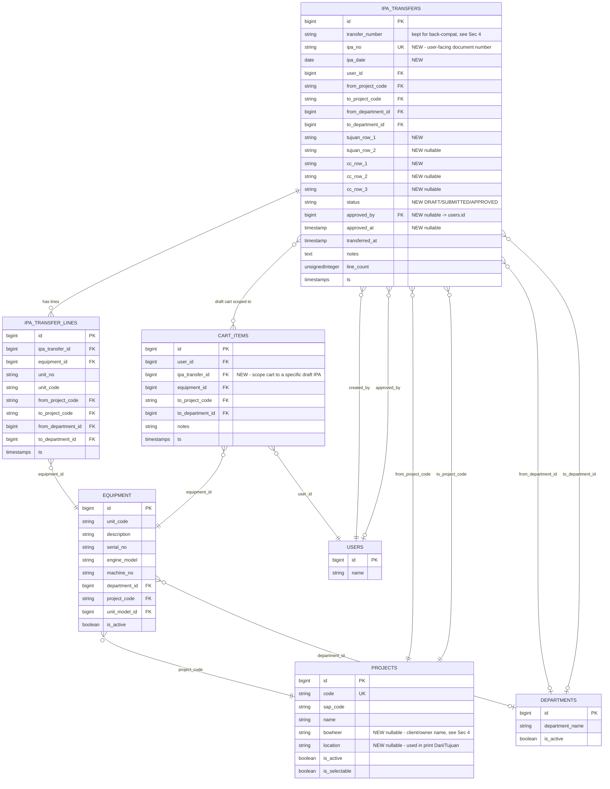

**Purpose**: Detailed redesign plan for the Movings / IPA module — bring `arkfleet-next` to parity with the legacy `ark-fleet-10` print layout and add proper IPA document semantics (numbering, addressee/CC, approval), while keeping the working cart-based equipment picker.
**Last Updated**: 2026-07-19
**Status**: Draft — pending review

---

## 1. Overview & Objectives

**IPA (Instruksi Pemindahan Alat)** — "Equipment Transfer Instruction" — is the internal authorization document ARKA uses to move a unit of equipment from one project/location to another. It is a formal letter: it has an addressee ("Kepada Yth."), CC recipients, a from/to project block, an equipment table, remarks, and a signature block. Historically (legacy `ark-fleet-10`) it was printed on letterhead and physically signed in three copies (HO Jakarta / sender / receiver).

In `arkfleet-next`, IPA exists today only as a **transfer transaction** (`ipa_transfers` + `ipa_transfer_lines`): a cart-based workflow that updates `equipment.project_code` / `equipment.department_id` and produces a bare-bones PDF. It has no IPA number entered by the user, no addressee/CC fields, no approval status, and its PDF does not resemble the legacy document at all.

**Goals of this redesign**:

1. **Match the legacy print layout exactly** — logo, company header, "Kepada Yth." / "CC" two-column block, Dari/Tujuan table, equipment table with S/N & Engine info, remarks, signature block, three-sheet footer.
2. **Turn the transfer into a proper document**: an IPA number, an IPA date, addressee/CC free-text rows, and a DRAFT → SUBMITTED → APPROVED lifecycle instead of an instantaneous cart checkout.
3. **Improve the index page UX**: a real list/table of IPAs (not just "recent transfers" under the cart), with quick search + advanced filters, sorted by newest IPA date first — mirroring the legacy DataTable behavior.
4. **Keep what already works**: the cart (`cart_items`) equipment-picking workflow, the equipment→project/department update side effect on submit, PDF generation via `barryvdh/laravel-dompdf`, and department support (which legacy never had).

Non-goal: this plan does not change equipment master data, SAP sync, or permissions beyond what's needed for IPA status ('view' permission remains the gate; no new Spatie permission is strictly required, see §13).

---

## 2. Gap Analysis: Legacy vs Current

### What legacy `ark-fleet-10` IPA has that `arkfleet-next` is missing

| Legacy feature | File | Missing in arkfleet-next |
|---|---|---|
| User-entered `ipa_no` (unique) | `movings` table, `create.blade.php` | `ipa_transfers.transfer_number` is auto-generated only, not a user-facing field on a form |
| `ipa_date` (separate from `created_at`) | `movings` table | `ipa_transfers.transferred_at` is a timestamp set at submit time, not a plannable date |
| "Kepada Yth." two rows (`tujuan_row_1/2`) | `movings` table, `print_pdf.blade.php` | No columns, no UI |
| "CC" three rows (`cc_row_1/2/3`) | `movings` table, `print_pdf.blade.php` | No columns, no UI |
| Formal two-step create flow: header form first (`movings.create`) → then add equipment (`moving_details.create`) | `MovingController@store` redirects to `moving_details.create` | Current flow adds equipment to a *global per-user cart* before any transfer/header exists |
| Dedicated print layout matching company letterhead, Dari/Tujuan table with `bowheer`/`location`, signature block, 3-sheet footer | `print_pdf.blade.php` | Current `pdf/ipa-transfer.blade.php` is a generic meta-table + line table, no letterhead, no signature block |
| Index as a searchable DataTable (server-side, quick search + advanced filters: IPA no, date range, origin, destination, equipment) sorted by date desc | `index.blade.php`, `MovingController@index_data` | Current index shows a cart + equipment picker; "Recent Transfers" is a plain paginated table with no filters |
| Equipment detail modal listing unit/model/plant type per IPA on hover | `index.blade.php` | Not present (superseded by dedicated Show page — acceptable, keep Show page instead) |
| Draft/edit/delete lifecycle before equipment is finalized (`flag = 'DRAFT'.userId`) | `movings` table `flag` column | No status concept at all — a submit is final and irreversible |
| Project `bowheer` (client/owner name) + `location` fields used in the Dari/Tujuan table | legacy `projects` table | `arkfleet-next` `projects` table (SAP-synced) only has `code`, `name`, `description` — **no `bowheer`/`location`** (see §4) |

### What `arkfleet-next` already has that legacy did not

- **Department tracking** (`from_department_id`/`to_department_id`) on both the transfer header and each line — legacy only tracked project.
- **Cart-based multi-select equipment picker** (`cart_items`) with per-item override of destination project/department — legacy added equipment one at a time via a separate "add detail" screen.
- **Automatic equipment mutation on submit** (`equipment.project_code`/`department_id` updated transactionally) — legacy's `moving_details` just linked equipment to a moving record; it did not appear to mutate the equipment's project (no such logic found in `MovingController`).
- **PDF generation via DomPDF already wired up** (`IpaTransferService::transferPdf`), just needs a new Blade view.
- **IPA summary report** (`reports/ipa-summary`) aggregating transfers — legacy had no equivalent report.
- **Modern stack**: Inertia + React + Ant Design ProTable, SAP-synced project/department masters, Spatie permissions — all reusable for the new UI.

**Net takeaway**: keep the current *data model direction* (transfer + lines + cart + department support), but graft on the legacy *document semantics* (number, date, addressee, CC, status) and *print layout*, and rebuild the index page as a filterable list-of-documents rather than a cart-first page.

---

## 3. ERD (Entity Relationship Diagram)



**New columns needed** are marked `NEW` above and detailed in §4. Note the `PROJECTS.bowheer`/`PROJECTS.location` gap — these are required by the legacy Dari/Tujuan print block (`{{ $project->code }} - {{ $project->bowheer }}, {{ $project->location }}`) but do not currently exist on `arkfleet-next`'s SAP-synced `projects` table.

---

## 4. Schema Changes

### 4.1 `ipa_transfers` — new migration `add_ipa_fields_to_ipa_transfers_table`

```php
Schema::table('ipa_transfers', function (Blueprint $table) {
    $table->string('ipa_no', 30)->nullable()->after('transfer_number');
    $table->date('ipa_date')->nullable()->after('ipa_no');
    $table->string('tujuan_row_1')->nullable()->after('to_department_id');
    $table->string('tujuan_row_2')->nullable()->after('tujuan_row_1');
    $table->string('cc_row_1')->nullable()->after('tujuan_row_2');
    $table->string('cc_row_2')->nullable()->after('cc_row_1');
    $table->string('cc_row_3')->nullable()->after('cc_row_2');
    $table->string('status', 20)->default('DRAFT')->after('cc_row_3');
    $table->foreignId('approved_by')->nullable()->after('status')->constrained('users')->nullOnDelete();
    $table->timestamp('approved_at')->nullable()->after('approved_by');
});

// backfill pass (same migration, after adding columns):
DB::table('ipa_transfers')->whereNull('ipa_no')->update([
    'status' => 'SUBMITTED', // all existing rows are already-completed transfers
]);
// ipa_no/ipa_date backfilled from transfer_number/transferred_at via a short update loop
// (chunked, not raw SQL, so the IPA-YYYYMMDD-NNN format is preserved as ipa_no)
```

Then a **second migration** once backfill is verified: `make ipa_no not-nullable + unique`.

```php
Schema::table('ipa_transfers', function (Blueprint $table) {
    $table->string('ipa_no', 30)->nullable(false)->change();
    $table->unique('ipa_no');
    $table->date('ipa_date')->nullable(false)->change();
});
```

### 4.2 `transfer_number` vs `ipa_no` — decision

Two options were considered:

1. **Rename `transfer_number` → `ipa_no`** — cleaner single source of truth, but touches every reference (`IpaTransferService::generateTransferNumber()`, PDF filename, Show.jsx title, ipa-summary report/export, any legacy-migration mapping).
2. **Keep both, `ipa_no` becomes the canonical user-facing/document number; `transfer_number` becomes an internal-only system reference** (e.g. `IPA-20260719-001`, still auto-generated, still unique, kept for audit/back-compat with any external references and the existing `generateTransferNumber()` helper).

**Recommendation: Option 2 (keep both).** `ipa_no` is what the user types/sees on the form and on the printed document (matches legacy exactly, supports manual override — see §13). `transfer_number` remains the auto-generated internal key, defaults to the same value as `ipa_no` when the user leaves it blank, and continues to back the PDF filename and existing reports without any renames. This avoids a risky column rename + Cast/Fillable/Blade find-and-replace across the codebase for zero functional gain.

### 4.3 `cart_items` — associate cart with a specific IPA (migration: `add_ipa_transfer_id_to_cart_items_table`)

```php
Schema::table('cart_items', function (Blueprint $table) {
    $table->foreignId('ipa_transfer_id')->nullable()->after('user_id')
        ->constrained('ipa_transfers')->cascadeOnDelete();
});
```

- Uniqueness constraint changes from `(user_id, equipment_id)` to `(ipa_transfer_id, equipment_id)` — two different DRAFT IPAs by the same user can independently stage the same equipment_id (edge case, unlikely but correctness matters). Drop the old unique index, add the new one in the same migration.
- Cart rows created before an IPA header exists are not possible anymore under the new flow (§5) — a DRAFT `ipa_transfers` row is always created first.

### 4.4 `projects` — add `bowheer` and `location` (migration: `add_bowheer_location_to_projects_table`)

```php
Schema::table('projects', function (Blueprint $table) {
    $table->string('bowheer')->nullable()->after('name'); // client/owner name shown in Dari/Tujuan print block
    $table->string('location')->nullable()->after('bowheer');
});
```

These are SAP-synced-adjacent but not present in SAP profit-center data today; treat as manually-maintained enrichment fields on the Projects master page (out of scope to build that UI in this plan — flag as a dependency, see §13). If left blank, the print template falls back to `project->name` only (no dash/comma artifacts).

### 4.5 Migration strategy

1. Ship `add_ipa_fields_to_ipa_transfers_table` (nullable columns + `status` default `DRAFT`) — non-breaking.
2. Ship a data-backfill step (Artisan command or migration-embedded, chunked over existing rows) that sets `ipa_no = transfer_number`, `ipa_date = transferred_at->toDateString()`, `status = 'SUBMITTED'` for all pre-existing rows (they represent completed legacy-style transfers under the old one-shot flow).
3. Ship `add_ipa_transfer_id_to_cart_items_table`.
4. Ship `add_bowheer_location_to_projects_table`.
5. Once backfill is confirmed in staging, ship the tightening migration (`ipa_no` NOT NULL + UNIQUE, `ipa_date` NOT NULL).
6. Run all migrations `php artisan migrate` (per user rule: don't run `npm run dev`/`serve` — just note it needs running).

---

## 5. UX Flow

```mermaid
flowchart TD
    A[Index page: IPA list] -->|Click "Create New IPA"| B[IPA Form: header fields]
    B -->|Save as DRAFT| C[Add Equipment page]
    C -->|Search source-project equipment| D{Add to cart}
    D -->|repeat| C
    C -->|Click "Submit IPA"| E[Confirm submit dialog]
    E -->|Confirm| F[Backend: create lines, update equipment.project/department, status = SUBMITTED]
    F --> G[Redirect to Show page]
    G -->|Download PDF| H[Legacy-style PDF]
    G -->|Approve, if permitted| I[status = APPROVED, approved_by/at set]
    A -->|Click row 'Edit', DRAFT only| B
    A -->|Click row 'View'| G
    A -->|Click row 'Print'| H
    A -->|Click row 'Delete', DRAFT only| A
```

### Wireframe descriptions

- **Index page**: top bar has page title "Movings / IPA" + a primary `Create New IPA` button (top-right). Below: a filter card (quick search input + "Advanced Filters" collapsible panel). Below that: a `ProTable` of IPAs, one row per document, paginated server-side, sorted by `ipa_date` desc then `id` desc. No more equipment picker or cart on this page.
- **Create IPA form** (`/movings/create`): a Card with a form — two-column grid: IPA No | Date, From Project | To Project, From Department | To Department, Tujuan row 1 | Tujuan row 2, CC row 1 | CC row 2 | CC row 3 (three columns), Remarks (full width textarea). Submit button: "Save & Add Equipment" → creates DRAFT and redirects to Add Equipment page.
- **Add Equipment page** (`/movings/{moving}/equipment`): header summary (read-only recap of the IPA fields just entered, with an "Edit header" link back to the edit form) + a two-column layout identical in spirit to the old Index: left = searchable equipment table scoped to `from_project_code` (with an "Add to cart" button per row), right = current cart for this IPA with a "Submit IPA" button that becomes enabled once the cart is non-empty.
- **Show page** (`/movings/{moving}/show`): header Descriptions block (IPA No, Date, From/To Project, From/To Department, Tujuan/CC rows, Status badge, Approved by/at if applicable), a lines table, and action buttons (Download PDF, Approve if `status = SUBMITTED` and user can approve, Back to list).

---

## 6. IPA Form Fields

| Field | Input type | Required | Validation / Notes |
|---|---|---|---|
| `ipa_no` | Text input | Yes | `unique:ipa_transfers,ipa_no` (ignore current id on update); max 30 chars; auto-suggested placeholder `IPA-{{ today Ymd }}-001` pre-filled but editable (see §13) |
| `ipa_date` | Date picker (Ant `DatePicker`) | Yes | Defaults to today; format `YYYY-MM-DD` |
| `from_project_id` (maps to `from_project_code`) | Select, searchable | No (legacy required; recommend optional to preserve current behavior where internal-only transfers may not have a "from") | `exists:projects,code`; options = active + selectable projects |
| `to_project_id` (`to_project_code`) | Select, searchable | Yes | `exists:projects,code`; must differ from `from_project_code` (soft validation warning, not hard block — same project moves between departments are valid) |
| `from_department_id` | Select, allow clear | No | `exists:departments,id` |
| `to_department_id` | Select, allow clear | No | `exists:departments,id` |
| `tujuan_row_1` | Text input | Yes | max 255; "Kepada Yth." line 1, e.g. `Bpk. Ahmad — Site Manager` |
| `tujuan_row_2` | Text input | No | max 255; second addressee line |
| `cc_row_1` | Text input | Yes | max 255 |
| `cc_row_2` | Text input | No | max 255 |
| `cc_row_3` | Text input | No | max 255 |
| `remarks` | Textarea (3 rows) | No | max 1000 |

Server-side validation (Laravel rules, in `StoreIpaRequest`/`UpdateIpaRequest` or inline in controller per repo convention):

```php
[
    'ipa_no' => ['required', 'string', 'max:30', Rule::unique('ipa_transfers', 'ipa_no')->ignore($moving?->id)],
    'ipa_date' => ['required', 'date'],
    'from_project_code' => ['nullable', 'string', 'max:20', 'exists:projects,code'],
    'to_project_code' => ['required', 'string', 'max:20', 'exists:projects,code'],
    'from_department_id' => ['nullable', 'exists:departments,id'],
    'to_department_id' => ['nullable', 'exists:departments,id'],
    'tujuan_row_1' => ['required', 'string', 'max:255'],
    'tujuan_row_2' => ['nullable', 'string', 'max:255'],
    'cc_row_1' => ['required', 'string', 'max:255'],
    'cc_row_2' => ['nullable', 'string', 'max:255'],
    'cc_row_3' => ['nullable', 'string', 'max:255'],
    'remarks' => ['nullable', 'string', 'max:1000'],
]
```

---

## 7. Print Layout Specification

This is the highest-priority deliverable — the printed IPA is a legal/administrative document and must match the legacy layout exactly. New Blade view: `resources/views/pdf/ipa-transfer.blade.php` (replace current content).

```
Page: A4 Portrait, DejaVu Sans font (DomPDF-safe), ~11-12px base size

Header:
  - Company logo, left-aligned (reuse or re-export legacy logo asset -> public/images/logo.png)
  - "PT ARKANANTA APTA PRATISTA" — centered, large (h3-equivalent, bold)
  - "INSTRUKSI PEMINDAHAN ALAT (IPA)" — centered (h5-equivalent)
  - "No. {{ $transfer->ipa_no }}" — centered
  - <hr>

Section 1 — Addressee & CC (two-column table, no borders):
  Left column (~40% width):
    "Kepada Yth." (bold)
    "- {{ $transfer->tujuan_row_1 }}"
    "- {{ $transfer->tujuan_row_2 }}"   (omit line if empty)
  Right column (~60% width):
    "CC" (bold)
    "- {{ $transfer->cc_row_1 }}"
    "- {{ $transfer->cc_row_2 }}"       (omit line if empty)
    "- {{ $transfer->cc_row_3 }}"       (omit line if empty)
  <hr>

Intro paragraph (static, matches legacy verbatim):
  "Dengan hormat,"
  "Sesuai dengan kebutuhan Operasional Perusahaan, mohon segera dilakukan pemindahan alat sbb.:"

Section 2 — Transfer Direction (bordered table, 2 columns):
  Header row: "Dari" | "Tujuan"
  Data row:
    "{{ from_project->code }} - {{ from_project->bowheer }}, {{ from_project->location }}"
    "{{ to_project->code }} - {{ to_project->bowheer }}, {{ to_project->location }}"
  (fallback to project->name if bowheer/location are null, see Sec 4.4)
  <hr>

Section 3 — Equipment List (bordered striped table):
  Columns: # | Unit No | Description | S/N | Engine Model | Engine No
  One row per $transfer->lines, using:
    line.equipment.unit_code   -> "Unit No"
    line.equipment.description -> "Description"
    line.equipment.serial_no   -> "S/N"
    line.equipment.engine_model -> "Engine Model"
    line.equipment.machine_no  -> "Engine No"
  Final row spans all columns: "Remarks: {{ $transfer->notes }}"

Section 4 — Signature Block (right-aligned, ~30% width table cell):
  "Balikpapan, {{ $transfer->ipa_date->translatedFormat('d F Y') }}"
  "Disetujui oleh"
  (5 blank lines for physical/wet signature space)
  "({{ $transfer->approvedBy?->name ?? 'Christina W.' }})"
  "Asset & Insurance Sec. Head"

Footer (fixed at bottom, 3-column, small muted text):
  Left: "sheet 1 : HO Jakarta"
  Center: "sheet 2 : Pengirim Unit"
  Right: "sheet 3 : Penerima Unit"
```

Implementation notes:

- Legacy used AdminLTE Bootstrap classes (`.table`, `.invoice-info`) rendered by the browser's native print dialog (`window.print()` on load) — NOT DomPDF. `arkfleet-next` already renders via `barryvdh/laravel-dompdf`, so the new Blade view must use **plain inline-CSS-friendly HTML tables** (DomPDF has limited CSS support — no flexbox/grid, limited `float`), mirroring the same visual structure with `<table>`-based layout instead of Bootstrap grid classes.
- Reuse the existing `<style>` block pattern from the current `ipa-transfer.blade.php` (border-collapse tables, `DejaVu Sans` font) as the CSS foundation, extended with header/signature/footer blocks.
- Company logo: check `public/` for an existing asset (e.g. from Settings/branding) — if none, request the logo file be added to `public/images/logo.png` or `storage/`; do not hardcode a URL to the legacy repo.
- `IpaTransferService::transferPdf()` needs to eager-load `approvedBy` and `fromProject`/`toProject` (new relations — see §4) in addition to current eager loads.
- PDF filename changes from `{transfer_number}.pdf` to `{ipa_no}.pdf` (or keep `transfer_number` per §4.2 decision — either is fine since they default to the same value).

---

## 8. Index Page Design

**Current state**: `resources/js/Pages/Operations/Movings/Index.jsx` is a two-column cart layout (available equipment picker + cart sidebar) with a small "Recent Transfers" table underneath, no filters beyond a single search box scoped to equipment.

**New design** — `Index.jsx` becomes a pure list-of-documents page (equipment picking moves to a dedicated Add Equipment page per §5):

- **Primary view**: `ProTable` of all `ipa_transfers`, sorted by `ipa_date` desc, then `id` desc (matches legacy exact sort order).
- **Columns**:
  | Column | Source |
  |---|---|
  | IPA No | `ipa_no` |
  | IPA Date | `ipa_date` formatted `DD MMM YYYY` |
  | From Project | `from_project_code` (+ project name via relation) |
  | To Project | `to_project_code` (+ project name) |
  | Equipment Count | `line_count` |
  | Status | colored `Tag`/badge — see below |
  | Created By | `user.name` |
  | Actions | icon buttons, see below |
- **"Create New IPA"** button: `type="primary"`, `icon={<PlusOutlined />}`, top-right of the page header, routes to `/movings/create`.
- **Filter bar** above the table (Card, collapsible advanced section) — see §9 for full spec.
- **Status badges** (Ant `<Tag>`):
  - `DRAFT` → `color="gold"`
  - `SUBMITTED` → `color="blue"`
  - `APPROVED` → `color="green"`
- **Row actions** (icon buttons in the Actions column):
  - View (`EyeOutlined`) — always visible, routes to Show
  - Edit (`EditOutlined`) — visible only when `status === 'DRAFT'`
  - Print PDF (`FilePdfOutlined`) — always visible (DRAFT prints a "DRAFT" watermark — nice-to-have, not required)
  - Delete (`DeleteOutlined`, danger) — visible only when `status === 'DRAFT'`, confirm via `Modal.confirm`

---

## 9. Filter Design

- **Quick search** (single `Input.Search`, full width in the filter card): server-side `LIKE` OR-matched against `ipa_no`, `ipa_transfer_lines.unit_code` (via `whereHas`), `from_project_code`/`to_project_code` (or joined project name), and `notes`. Mirrors legacy `quick_search` behavior in `MovingController@index_data`.
- **Advanced filters** (Ant `Collapse` panel, defaults closed):
  | Filter | Control | Matches against |
  |---|---|---|
  | `ipa_no` | Text input | `LIKE %value%` |
  | `date_from` / `date_to` | `DatePicker.RangePicker` (single control, two query params) | `ipa_date BETWEEN` |
  | `from_project_id` (`from_project_code`) | Searchable Select | exact match |
  | `to_project_id` (`to_project_code`) | Searchable Select | exact match |
  | `status` | Multi-select (`DRAFT`/`SUBMITTED`/`APPROVED`) | `whereIn` |
  | `unit_code` | Text input | `whereHas('lines', fn ($q) => $q->where('unit_code', 'like', ...))` |
- All filters combine with **AND** logic (quick search stays OR-internally, ANDed with every advanced filter).
- **Persistence**: every filter is a query param (`?search=&ipa_no=&date_from=&date_to=&from_project_code=&to_project_code=&status[]=&unit_code=&page=`), read via `request()->only([...])` server-side and passed back as `filters` prop, mirroring existing `filters?.search` pattern in current `Index.jsx`. Use `router.get('/movings', {...filters, page}, { preserveState: true })` for every filter/pagination change so the URL always reflects current state (shareable/bookmarkable, matches legacy "quick_search" UX intent even though legacy itself used client-side DataTables params, not URL params — this is an intentional improvement).
- **Reset button**: clears all filter state and calls `router.get('/movings')` with no query params.

Backend controller sketch (`MovingController@index`):

```php
$query = IpaTransfer::query()
    ->with(['user:id,name', 'fromProject:code,name', 'toProject:code,name'])
    ->when($request->search, fn ($q, $v) => $q->where(function ($inner) use ($v) {
        $inner->where('ipa_no', 'like', "%{$v}%")
            ->orWhere('notes', 'like', "%{$v}%")
            ->orWhere('from_project_code', 'like', "%{$v}%")
            ->orWhere('to_project_code', 'like', "%{$v}%")
            ->orWhereHas('lines', fn ($l) => $l->where('unit_code', 'like', "%{$v}%"));
    }))
    ->when($request->ipa_no, fn ($q, $v) => $q->where('ipa_no', 'like', "%{$v}%"))
    ->when($request->date_from, fn ($q, $v) => $q->whereDate('ipa_date', '>=', $v))
    ->when($request->date_to, fn ($q, $v) => $q->whereDate('ipa_date', '<=', $v))
    ->when($request->from_project_code, fn ($q, $v) => $q->where('from_project_code', $v))
    ->when($request->to_project_code, fn ($q, $v) => $q->where('to_project_code', $v))
    ->when($request->status, fn ($q, $v) => $q->whereIn('status', (array) $v))
    ->when($request->unit_code, fn ($q, $v) => $q->whereHas('lines', fn ($l) => $l->where('unit_code', 'like', "%{$v}%")))
    ->orderByDesc('ipa_date')
    ->orderByDesc('id');
```

---

## 10. Routes

New route table for `routes/operations.php` (replace current 5 `movings*` lines):

```php
Route::get('movings', [MovingController::class, 'index'])->name('movings.index');
Route::get('movings/create', [MovingController::class, 'create'])->name('movings.create');
Route::post('movings', [MovingController::class, 'store'])->name('movings.store');
Route::get('movings/{moving}/edit', [MovingController::class, 'edit'])->name('movings.edit');
Route::put('movings/{moving}', [MovingController::class, 'update'])->name('movings.update');
Route::delete('movings/{moving}', [MovingController::class, 'destroy'])->name('movings.destroy');

Route::get('movings/{moving}/equipment', [MovingController::class, 'addEquipment'])->name('movings.equipment');
Route::post('movings/{moving}/cart', [MovingController::class, 'addToCart'])->name('movings.cart.add');
Route::delete('movings/{moving}/cart/{cartItem}', [MovingController::class, 'removeFromCart'])->name('movings.cart.remove');

Route::post('movings/{moving}/submit', [MovingController::class, 'submit'])->name('movings.submit');
Route::post('movings/{moving}/approve', [MovingController::class, 'approve'])->name('movings.approve');

Route::get('movings/{moving}/show', [MovingController::class, 'show'])->name('movings.show');
Route::get('movings/{moving}/pdf', [MovingController::class, 'pdf'])->name('movings.pdf');
```

Route model binding param renamed from `{transfer}` to `{moving}` to match legacy naming (`Moving` model concept), even though the Eloquent model stays `IpaTransfer` (bind via `Route::model` or a custom key — or simply keep the PHP type-hint parameter named `$moving` while resolving `IpaTransfer::class`, e.g. `public function show(IpaTransfer $moving)`; Laravel resolves by type, param name is cosmetic only and does not require renaming the model class).

**Breaking change callout**: current cart routes are user-scoped (`/movings/cart`, `/movings/submit`, no IPA id). All frontend calls in `Index.jsx` (`router.post('/movings/cart', ...)`, `router.post('/movings/submit', ...)`) must be updated to include `{moving}` in the path. `Show.jsx`'s PDF link (`/movings/transfers/${id}/pdf`) also moves to `/movings/${id}/pdf`.

---

## 11. Implementation Phases

### Phase 1 — Schema & Backend (2-3 days)

- Create migration `add_ipa_fields_to_ipa_transfers_table` (§4.1) + backfill logic
- Create migration `add_ipa_transfer_id_to_cart_items_table` (§4.3)
- Create migration `add_bowheer_location_to_projects_table` (§4.4)
- Create tightening migration for `ipa_no`/`ipa_date` NOT NULL + UNIQUE (run after backfill verified)
- Update `IpaTransfer` model: fillable += `ipa_no, ipa_date, tujuan_row_1..2, cc_row_1..3, status, approved_by, approved_at`; casts += `ipa_date => date`, `approved_at => datetime`; relations += `approvedBy(): BelongsTo` (User), `fromProject(): BelongsTo` (Project via `from_project_code`), `toProject(): BelongsTo` (Project via `to_project_code`); add `isDraft()`/`isSubmitted()`/`isApproved()` helper methods
- Update `CartItem` model: fillable += `ipa_transfer_id`; add `ipaTransfer(): BelongsTo`
- Update `Project` model: fillable += `bowheer, location`
- Rewrite `IpaTransferService`:
  - `createIpa(int $userId, array $data): IpaTransfer` — creates DRAFT row (no lines yet)
  - `updateIpa(IpaTransfer $moving, array $data): IpaTransfer` — DRAFT-only guard
  - `addEquipment(IpaTransfer $moving, int $userId, array $data): CartItem` — replaces `addToCart`, scoped by `ipa_transfer_id`
  - `removeEquipment(CartItem $item): void`
  - `submitIpa(IpaTransfer $moving): IpaTransfer` — replaces `submitTransfer`; moves cart→lines, mutates equipment, sets `status = SUBMITTED`, clears cart for that IPA only
  - `approveIpa(IpaTransfer $moving, int $approverId): IpaTransfer` — sets `status = APPROVED`, `approved_by`, `approved_at`
  - keep `generateTransferNumber()` (still used as default/fallback for `transfer_number`, and as the ipa_no auto-suggest format)
  - `transferPdf(IpaTransfer $moving)` — update eager loads per §7
- Rewrite `MovingController`: `index` (list+filters, §9), `create`, `store`, `edit`, `update`, `destroy` (DRAFT-only), `addEquipment` (renders Add Equipment page), `addToCart`, `removeFromCart` (both re-scoped to `{moving}`), `submit`, `approve`, `show`, `pdf`
- Update `routes/operations.php` per §10
- Update `docs/architecture.md` Routes table + Database Schema section once implemented

### Phase 2 — Frontend (3-4 days)

- New `Index.jsx` — table + filter bar (§8, §9), remove cart/equipment-picker UI from this page
- New `Create.jsx` — IPA header form (§6)
- New `Edit.jsx` — same form, DRAFT-only, pre-filled
- New `AddEquipment.jsx` — equipment picker + cart, scoped to one `moving` (adapted from current `Index.jsx`'s left/right columns)
- Refactor `Show.jsx` — add Status tag, Tujuan/CC rows, Approve button (permission-gated), Approved by/at
- Update `AuthenticatedLayout.jsx` nav — no structural change needed if "Movings" menu item already links to `movings.index`; verify label still reads "Movings / IPA"

### Phase 3 — Print Layout (1-2 days)

- Rewrite `resources/views/pdf/ipa-transfer.blade.php` per §7 exactly
- Source/confirm company logo asset location
- Test rendering with `barryvdh/laravel-dompdf` locally (`php artisan tinker` → `Pdf::loadView(...)->save(...)` or via the `/movings/{id}/pdf` route) — check DomPDF's handling of the two-column addressee/CC block and the fixed footer (DomPDF footers need `<script type="text/php">` or repeated table rows; plan to use a simple bottom-page table row, not a true fixed footer, to avoid DomPDF footer quirks)
- Verify Indonesian date formatting (`translatedFormat('d F Y')` requires `App::setLocale('id')` or use `Carbon::setLocale('id')` — confirm current app locale config)

### Phase 4 — Polish & Testing (1 day)

- Validation + error handling for all new form fields (client + server)
- Edge cases: DRAFT IPA with zero equipment lines (block submit, show inline error, same as current empty-cart check), duplicate `ipa_no`, deleting a DRAFT that has cart items (cascade via FK), user tries to edit/delete a non-DRAFT IPA (403/redirect with flash error)
- Responsive check on Index filter bar + table (mobile breakpoints, matches existing ProTable patterns elsewhere in the app)
- Permission checks: reuse `permission:view` middleware; decide/implement approve-gating per §13
- UAT pass against `docs/UAT-checklist.md` conventions — add a Movings/IPA section there if one doesn't exist
- Update `docs/architecture.md`, `docs/decisions.md` (log the `ipa_no` vs `transfer_number` decision from §4.2), `MEMORY.md` if any DomPDF/footer gotchas are discovered

---

## 12. Conventions to Follow (from codebase)

- **Inertia 2 + React 18 + Vite** — all new pages under `resources/js/Pages/Operations/Movings/*.jsx`, default export, `Head` + `AuthenticatedLayout` wrapper exactly like existing `Index.jsx`/`Show.jsx`.
- **Ant Design 5 + `@ant-design/pro-components`** — use `ProTable` for all list views (server-side `pagination`, `search={false}`, `options={false}` pattern already established).
- **Permission gate**: `abort_unless($request->user()?->can('view'), 403);` at the top of every controller method, matching current `MovingController`. No new Spatie permission unless §13's approve-gating decision requires one.
- **Server-side pagination**: `->paginate(N)->withQueryString()`, `page` query param, `router.get(url, {...filters, page}, { preserveState: true })` on the frontend — matches current `availableEquipment`/`transfers` props.
- **Form validation**: inline `$request->validate([...])` in controller methods (no FormRequest classes currently used elsewhere in this controller — stay consistent unless the team wants to introduce FormRequests project-wide).
- **PDF generation**: `Barryvdh\DomPDF\Facade\Pdf::loadView(...)->setPaper('a4', 'portrait')`, matches current `transferPdf()`.
- **Route naming**: `movings.index`, `movings.create`, `movings.store`, `movings.edit`, `movings.update`, `movings.destroy`, `movings.equipment`, `movings.cart.add`, `movings.cart.remove`, `movings.submit`, `movings.approve`, `movings.show`, `movings.pdf` — standard Laravel resourceful naming.
- **Migrations**: one column-add migration per logical schema change (per user rule, use `php artisan make:migration` — do not hand-create files/folders).
- **Views**: any new Blade file via `php artisan make:view` per user rule (the print PDF view already exists, so this only applies if new report/PDF views are added).

---

## 13. Open Questions / Decisions

| Question | Legacy behavior | Recommendation |
|---|---|---|
| Auto-generated or manual IPA number? | Manual, free text, unique | **Auto-generate a suggested value** (`IPA-{Ymd}-{seq}`, reusing `generateTransferNumber()`) and **pre-fill it in the form as editable** — user can override before saving. Keeps the "manual" flexibility legacy relied on (some IPAs may need to match a paper form number issued elsewhere) while reducing friction for the common case. |
| Should "tujuan"/"cc" be free text or dropdowns? | Free text | **Keep free text.** Recipients are often external or role-based text ("Site Manager — Project X"), not necessarily `users` table entries. Free text preserves this flexibility; no change needed. |
| One equipment at a time, or multi-select? | One at a time via separate "add detail" screen | **Keep the current cart workflow** (multi-add before submit) — it's strictly better UX than legacy's one-at-a-time flow and requires no behavior change, just re-scoping to `ipa_transfer_id` (§4.3). |
| Static or dynamic signature block? | Static "(Christina W.) / Asset & Insurance Sec. Head" | **Dynamic with static fallback**: use `$transfer->approvedBy?->name ?? 'Christina W.'` and a configurable job title (either a new `approver_title` column, or a config value `config('ipa.default_approver_title')` if the title is expected to stay constant regardless of who approves). Recommend the config-value approach to avoid another schema column unless multiple approvers with different titles are expected. |
| Should DRAFT IPAs be visible to all users or only the creator? | N/A (legacy had a `flag` marking drafts but the index still showed everything to all users) | **Visible to all users with `view` permission** (matches legacy index behavior which had no creator-scoping), but **Edit/Delete restricted to the creator** (`$moving->user_id === auth()->id()`) **or an admin/manager role** — needs a decision on whether a second permission (e.g. `manage-movings`) is introduced for cross-user edit rights, or whether this is left as creator-only + no override for v1. Recommend creator-only for v1, revisit if ops team requests supervisor override. |
| Who can Approve? | No approval concept existed in legacy | **New decision needed.** Options: (a) any `view`-permitted user can approve their own or others' submitted IPAs (simplest, but weak control), (b) introduce a new Spatie permission `movings.approve` restricted to a manager role, (c) merge "submit" and "approve" into one step (skip the APPROVED status entirely, matching legacy which had no approval step at all). **Recommend (c) for v1** — ship DRAFT → SUBMITTED only, treat SUBMITTED as final (closest to legacy's actual behavior and to current `arkfleet-next` behavior), and defer the APPROVED status + `movings.approve` permission to a v2 iteration once the ops team confirms an approval step is actually wanted. This descopes `approve()` controller method and `approved_by`/`approved_at` usage from Phase 1-4 into a documented backlog item — flag in `docs/backlog.md`. |
| `projects.bowheer`/`location` — who maintains these? | Manually entered in legacy Projects CRUD | Not built in this plan (see §4.4). Needs a small addition to the existing Projects master page (`/masters/projects`) to let users edit these two fields, since they are not SAP-synced. Flag as a **Phase 1 dependency**: without this, the Dari/Tujuan print block falls back to project name only, which is a degraded (but non-blocking) print output. |

---

## Appendix: File Inventory (for implementers)

**Backend (existing, to modify)**:
- `app/Http/Controllers/Operations/MovingController.php`
- `app/Models/IpaTransfer.php`, `app/Models/IpaTransferLine.php`, `app/Models/CartItem.php`, `app/Models/Project.php`
- `app/Services/Operations/IpaTransferService.php`
- `routes/operations.php`
- `resources/views/pdf/ipa-transfer.blade.php`

**Backend (new)**:
- 4 migrations per §4
- Optionally `app/Http/Requests/Operations/StoreIpaRequest.php` / `UpdateIpaRequest.php` if the team wants to move off inline validation (not required to match current conventions)

**Frontend (existing, to modify/replace)**:
- `resources/js/Pages/Operations/Movings/Index.jsx` (rewrite)
- `resources/js/Pages/Operations/Movings/Show.jsx` (extend)

**Frontend (new)**:
- `resources/js/Pages/Operations/Movings/Create.jsx`
- `resources/js/Pages/Operations/Movings/Edit.jsx`
- `resources/js/Pages/Operations/Movings/AddEquipment.jsx`

**Docs to update post-implementation**: `docs/architecture.md` (routes + schema tables), `docs/decisions.md` (§4.2 decision record), `docs/todo.md` (move phases in as tracked tasks), `docs/backlog.md` (defer Approve workflow + Projects bowheer/location UI if descoped per §13), `MEMORY.md` (any DomPDF footer/locale gotchas found during Phase 3).
